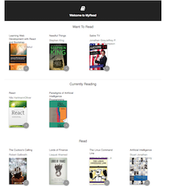
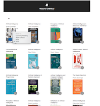

## MyReads : A Book Lending App Built using REACT.js

### Project Setup

The REACT application was created with create-react-app and requires only npm install and npm start to get it installed and launched.

#### Installation and Launching
clone the Project - git clone https://github.com/sonalikatara/MyRead

install the dependencies - npm install

start the project with npm - npm start serve

listen the server on http://localhost:3000

### Main Page

The main page shows 3 shelves for books (currently reading, want to read, and read)

It shows a control that allows users to move books between shelves. The control should is tied to each book instance.

When the browser is refreshed, the same information is displayed on the page.

### Search Page

The search page has a search input field. As the user types into the search field, books that match the query are displayed on the page.

Search results on the search page allow the user to select “currently reading”, “want to read”, or “read” to place the book in a certain shelf.

When an item is categorized on the search page, and the user navigates to the main page, it appears on that shelf in the main page.

### Routing

The main page contains a link to the search page. When the link is clicked, the search page is displayed and the URL in the browser’s address bar is /search.

The search page contains a link to the main page. When the link is clicked, the main page is displayed and the URL in the browser’s address bar is /.

### Code Functionality

Component state is passed down from parent components to child components. The state variable is not modified directly - setState() function is used correctly.

Books have the same state on both the search page and the main application page: If a book is on a bookshelf, that is reflected in both locations.

